# Sunny
**这是一个基于AspNetCore+EFCore的快速开发框架(NetCore2.1),用更少的代码去实现目标,希望可以为更多的人节省时间.**


### 目前已集成和实现的内容

- <a href="#snowflakeId">SnowflakeId (Twitter的雪花Id算法)</a>
- <a href="#autoMapper">AutoMapper (实体间类型转换)</a>
- <a href="#quartZ">Quartz (定时任务)</a>
- <a href="#apiValidation">FluentValidation Api参数模型验证</a>
- <a href="#argsBind">Api参数模型绑定</a>
- <a href="#swaggerDoc">Swagger Api文档生成</a>
- <a href="#t4DbModel">T4模板用于为DbModel生成EFCore使用的FluentApi配置文件</a>
- <a href="#exMiddware">全局异常处理中间件</a>
- <a href="#tokenMiddware">Token验证中间件</a>
- <a href="#netLog">网络日志 记录失败时会记到本地文件</a>
- <a href="#autoDi">自动依赖注入</a>
- <a href="#redis">Redis</a>
- <a href="#jsonFormat">Long,Decimal,DateTime的Json处理</a>
- <a href="#apiFormat">Api统一返回格式 (code,data,msg)</a>
- <a href="#dynamicProp">类型扩展动态属性</a>
- <a href="#dynamicProp">分页处理</a>
- <a href="#netHelper">网络铺助(发邮件,Ip信息查询)</a>
- <a href="#stringEnumEx">字符串与枚举相关的扩展</a>
- <a href="#imageHelper">图片缩放,水印,验证码图片等</a>
- <a href="#fileHelper">Xml文件,文本文件读取写入</a>
- <a href="#security">加解密相关</a>
- <a href="#base64">Base64序列化相关</a>

---

### 未来打算集成和实现的内容

- *发送短信*
- *Lucence*
- *RabbitMq*
- *支付相关(微信,支付宝)*
- *SignalR*
- *微信登录*
- *基于Vue的后台管理UI*
- *Sso*

---  

### 使用文档

#### 快速开始


**(备注:文档中的斜体部分是作为建议,不是必须的.)**

<br/>
<br/>

**创建一个AspNetCore的WebApi项目**,从Nuget中搜索SunnyApi并引用

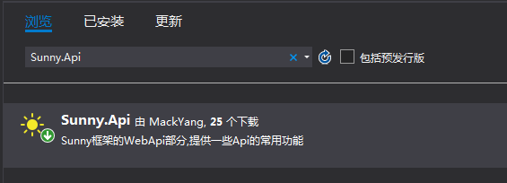


*建议将UseDemo\ApiDemo中的[Program.cs](https://github.com/MackYang/Sunny/blob/master/UseDemo/ApiDemo/Program.cs)类定义部分复制到您的Program.cs中.*

请将UseDemo\ApiDemo中的[appsettings.json](https://github.com/MackYang/Sunny/tree/master/UseDemo/ApiDemo/appsettings.json)文件复制到您的项目中进行替换,并将[StartUp.cs](https://github.com/MackYang/Sunny/tree/master/UseDemo/ApiDemo/Startup.cs)类定义部分复制到您的StartUp.cs中,在报红的地方按Alt+Enter引入对应的命名空间.


将StartUp.cs中的MyDbContext部分换成您项目中自定义的数据库上下文.

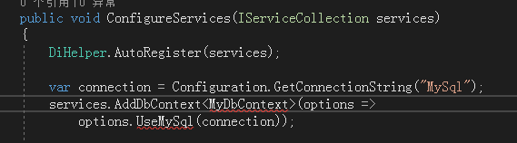


<br/>
<br/>

**创建一个NetCore的类库项目**,作为您的数据库访问层,并在该项目中引入Sunny.Repository的Nuget包

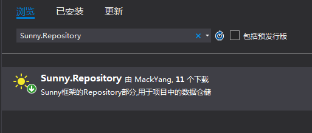


新建一个类作为您的数据库上下文,如MyDbContext,将RepositoryDemo中的[MyDbContext.cs](https://github.com/MackYang/Sunny/blob/master/UseDemo/RepositoryDemo/MyDbContext.cs)类定义部分的代码复制到您的类中.

记得将FluentApiTools.ApplyDbModelFluentApiConfig(modelBuilder, "RepositoryDemo");中的"RepositoryDemo"修改成您Repository项目的名称,以便接下来应用FluentApi的DbModel配置.


新建一个类作为您设计时的上下文工厂,并请将[DesignTimeDbContextFactory](https://github.com/MackYang/Sunny/blob/master/UseDemo/RepositoryDemo/DesignTimeDbContextFactory.cs)中的类定义部分代码复制到该类中,
用于将DbModel的修改应用到数据库中.


新建一个DbModel文件夹,内部结构可参照RepositoryDemo项目中的[DbModel](https://github.com/MackYang/Sunny/tree/master/UseDemo/RepositoryDemo/DbModel).


*Model用于存放您定义的DbModel类*
*ModelConfig用于存放FluentApi的配置,这个文件夹中的文件是自动生成的,主要作用是将DbModel中的大写转成数据库中的下划线,配置id等,字段的内容长度等,通常生成完成后,需要手动修改某些字段长度,生成部分具体操作请见<a href="#t4DbModel">使用T4模板自动生成DbModel的FluentApi配置</a>*
*RelationMap用于存放您DbModel关系间的配置,在遵循微软EF约定的默认关系规则情况下,通常情况不需要手动配置*


*建议您的DbModel继承自BaseModel,BaseModel里包含了Id,CreaterId,CreateTime,UpdaterId,UpdateTime等.*

*如:*

``` cs
 public class Student : BaseModel
    {
        public Student() { }

        public string StudentName { get; set; }

        public int Age { get; set; }

    }

```


*建议新建一个DbSet.cs文件,作为MyDbContext的分部类,把所有的DbSet放在该文件中*

*如:*
``` cs
 public partial class MyDbContext
    {
        public DbSet<Student> Student { get; set; }

        public DbSet<StudentAddress> StudentAddress { get; set; }

        public DbSet<IdTest> IdTest { get; set; }
    }

```


<br/>
<br/>
<a name="t4DbModel">使用T4模板自动生成DbModel的FluentApi配置</a>

**创建一个NetCore的控制台应用程序项目**,用于生成T4模板,并在该项目中引用您的Repository项目,以及引用Sunny.TemplateT4的Nuget包
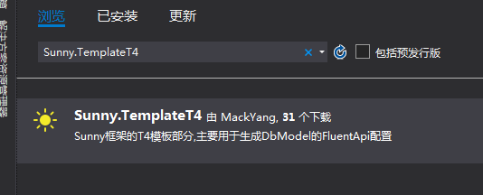

将UseDemo/TemplateT4Demo下的[Program.cs](https://github.com/MackYang/Sunny/blob/master/UseDemo/TemplateT4Demo/Program.cs)类定义部分复制到您的Program.cs中替换后修改下图所示的地方为您的Repository项目名称.
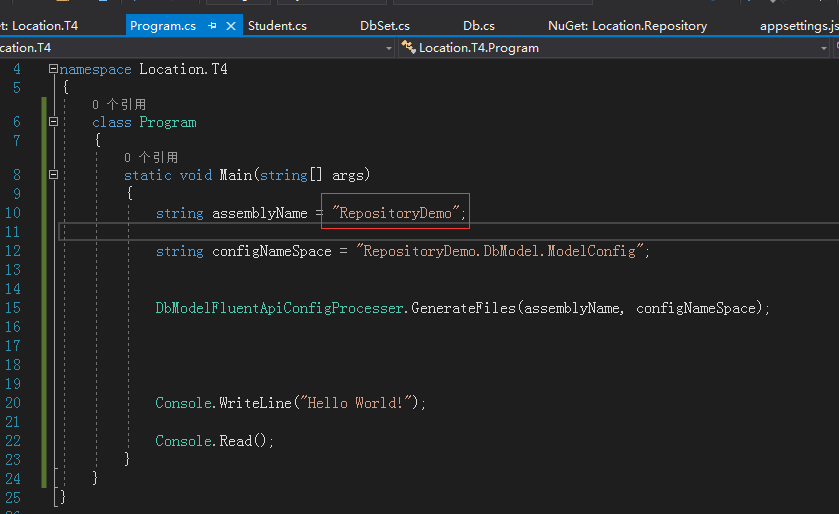

运行该项目,如果没有指定输出路径,默认输出到D:\SunnyFramework\Output\DbConfig\下,打开该目录,把生成的文件复制到您Repository项目中的ModelConfig文件夹下按实际需要做相应修改.


*DbModel写好之后,再用T4模板生成FluentApi配置,就可以通过Add-Migration xx 和 Update-Database将DbModel应用到数据库中了.*


*建议创建一个Service项目对Repository中的数据库层进行业务逻辑封装,再提供给Api层调用.*

---

#### <a name="snowflakeId">使用SnowflakeId</a>

在StartUp.cs文件Configure方法中进行初始化
```cs
IdHelper.InitSnowflake(Configuration.GetSection("SunnyOptions:SnowflakeOption").Get<SnowflakeOption>());

```
然后在您要使用的地方进行调用
```cs
 IdTest model = new IdTest();
 model.Id = IdHelper.GenId();
```

---

#### <a name="autoMapper">使用AutoMapper</a>

在StartUp.cs文件ConfigureServices方法中启用AutoMapper

```cs
services.AddAutoMapper();
```

创建一个类,继承自Profile类,并在构造器里配置各类型的转换关系

```cs
    public class ResponseMapperConfig : Profile
    {
        public ResponseMapperConfig()
        {

            CreateMap<IdTest, Customer>()
                .ForMember(cus => cus.LocalType, opt => opt.MapFrom(id => id.requestType)).ReverseMap();
            //手动指定字段映射关系
            //.ForMember(cus => cus.LocalType, opt => opt.MapFrom(id => id.requestType))
            //.ReverseMap()映射反向转换

            CreateMap<Buyer, Seller>().ReverseMap();
           
        }


    }
```

在要使用的类里通过构造函数注入一个IMapper类型的对象mapper,然后在需要转换的地方获取转换后的类型

``` cs

IMapper mapper;

public SomeClass(IMapper mapper)
{
    this.mapper=mapper;
}

public void SomeMethod()
{
    Buyer getBuyer = mapper.Map<Buyer>(seller);
}
```

---

#### <a name="quartZ">使用定时任务</a>

在Api项目下创建一个类,实现IJobEntity接口

```cs
 public class JobB : IJobEntity
    {

        public string JobName => "this job B Name";

        public string Describe => "this job B Describe";

        IStudentServic studentServic;

        public JobB(IStudentServic studentServic)
        {
            this.studentServic = studentServic;

        }


        public async Task ExecuteAsync(IJobExecutionContext jobContext)
        {
            Console.WriteLine(jobContext.JobDetail.JobDataMap["pxxx"]);//使用了配置中传来的参数,参数的名称要和配置里的一样
            Console.WriteLine( (await studentServic.GetStudent()).StudentName);

        }

    }
```

在appsetting.json中配置任务:

```json
"JobOption": [
      {
        //Job所的的类名称
        "JobClassName": "JobB",
        //Job所属的组,同一组中不能有2个相同的任务
        "JobGroup": "group1",
        //Job在什么时候运行,用Cron表达式
        "RunAtCron": "*/55 * * * * ?",
        //Job的参数,没有可以不写
        "Args": {
          //参数名字和你在任务中写的要相同
          "pxxx": "kkk",
          "nnn": 123
        }
      },

      {
        //Job所的的类名称
        "JobClassName": "JobA",
        //Job在什么时候运行,用Cron表达式
        "RunAtCron": "*/59 * * * * ?"

      }
    ]
```

在StartUp.cs的ConfigureServices方法中注册任务服务
```cs
services.AddSingleton<ISchedulerFactory, StdSchedulerFactory>();//注册ISchedulerFactory的实例。
```

在StartUp.cs的Configure方法中启用Job,启用后,Job会在配置的时间运行,届时会将运行时间及任务运行耗时等信息写入到日志.

```cs
 public void Configure(IApplicationBuilder app, IHostingEnvironment env, ILoggerFactory loggerFactory, ISchedulerFactory schedulerFactory)
        {
            app.InitServiceProvider();
            app.EnableJob(Configuration, schedulerFactory);
        }
```

---

#### <a name="apiValidation">Api参数验证</a>

在StartUp.cs中注册Fluent验证:
```cs
services.AddMvcCore()
                .AddFluentValidation()
```

在Api项目中创建一个类,继承自Validator<T>,如:

```cs
 public class CustomerValidator : Validator<Customer>
    {
        public CustomerValidator()
        {
            RuleFor(x => x.Surname).NotEmpty();
            RuleFor(x => x.Forename).NotEmpty().WithMessage("PleasFFe specify a first name");
            RuleFor(x => x.Discount).NotEqual(0).When(x => x.HasDiscount);
            RuleFor(x => x.Address).Length(20, 250);
            RuleFor(x => x.Postcode).Must(BeAValidPostcode).WithMessage("Please specify a valid postcode");
        }

        private bool BeAValidPostcode(string postcode)
        {
            return postcode == "123";
            // custom postcode validating logic goes here
        }
    }
```

在Api中直接使用实体Customer,进入方法之前会先对customer验证,如果验证不通过不会进入方法内部,会返回相应的提示信息:
```cs
 /// <summary>
        /// 带返回值的成功场景测试,测试模型验证
        /// </summary>
        /// <returns></returns>
        [HttpPost("Get2")]
        public Result<A> Get2(Customer customer)
        {

            return this.Success(new A { FullName = "AbcYH", Age = 123.123456789m, MFF = long.MaxValue });
        }
```

---

#### <a name="argsBind">参数模型绑定</a>

在写参数时可以不显示的声明[FromBody],[FromQuery],[FormHeader]等,默认是[FromBody],如果不是通过body传参,可以显示声明传参方式.

---

#### <a name="swaggerDoc">生成Swagger文档</a>

请设置您Api项目的生成选项,输出xml以便SwaggerUI中能看到Api的注释内容
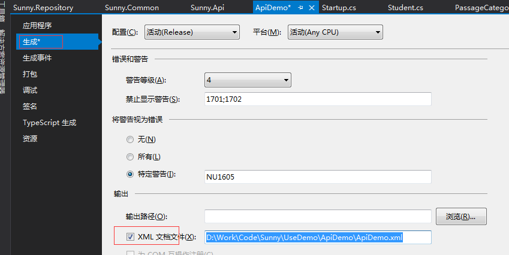


在StartUp.cs的ConfigureServices方法中加入以下代码:
```cs
 services.AddSwaggerGen(c =>
            {
                c.SwaggerDoc("v1", new Info { Title = "ApiDemo Project Swagger API", Version = "v1" });
                // 为 Swagger JSON and UI设置xml文档注释路径
                var basePath = Path.GetDirectoryName(typeof(Program).Assembly.Location);//获取应用程序所在目录（绝对，不受工作目录影响，建议采用此方法获取路径）
                var xmlPath = Path.Combine(basePath, "ApiDemo.xml");
                c.IncludeXmlComments(xmlPath);
            });
```

并将下图中的xml文件为您项目的xml文件名称
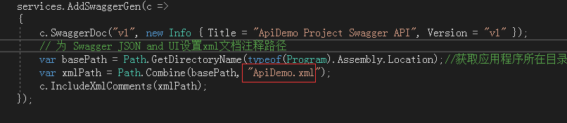


在StartUp.cs的Configure方法的最后加入以下代码:

```cs
 app.UseSwaggerUI(c =>
            {
                c.SwaggerEndpoint("/swagger/v1/swagger.json", "My API V1");
            });
```

运行Api项目,即可访问Swagger文档,如"https://localhost:44381/swagger"

---

#### <a name="exMiddware">全局异常处理</a>

在StartUp.cs的Configure方法中加入以下代码(通常在所有中间件前加入,以便捕获所有异常):

```cs
if (env.IsDevelopment())
            {
                app.UseDeveloperExceptionPage();
            }
            else
            {
                app.UseMiddleware<ErrorHandlingMiddleware>();
            }
```
这样在非开发环境中,都会使用异常处理中间件,将异常写入到日志中,并向客户端显示友好信息.

关于业务异常的处理:

在开发过程中,通常将业务逻辑封装在Service层中供Api层调用,那么当Service层内的数据不符合逻辑时,直接抛出业务异常,经中间件处理后将具体的信息返回给前端,但Code的枚举值不是异常的-1,而是业务失败的1.

```cs

 public async Task<Student> BizExceptionTest()
        {
            throw new BizException("订单不存在,这是一个测试抛出的业务异常");
        }
```

前端收到的数据:

```json

{
    "code": 1,
    "msg": "订单不存在,这是一个测试抛出的业务异常",
    "data": null
}
```

---

#### <a name="tokenMiddware">Token验证中间件</a>

在实际业务场景中,很多Api都是在访问前要验证是否登录,我们可以在appsetting.json中配置以指定路径开头的api需要验证后才能访问,如:

```json
"TokenValidateOption": {
      //将根据该值来从HttpHeader中存取对应的token值,默认就是"token"
      "TokenKey": "token",
      // 以此开头的API都需要验证Token,如果不需要可不配置
      "AuthApiStartWith": "/api"

    },
```

在StartUp.cs的ConfigureServices方法中加入以下代码:
```cs
services.Configure<TokenValidateOption>(Configuration.GetSection("SunnyOptions:TokenValidateOption"));
```

在StartUp.cs的Configure方法中加入以下代码(通常在app.UseMvc()中间件前):

```cs
app.UseMiddleware<TokenValidateMiddleware>();
```

这样一来,不用在每个需要登录的方法上加标注,中间件会从header中获取token的值,并以值作为key去缓存查询是否存在(需要您在登录成功的方法里将对应的token值写入到缓存,框架中默认的是redis),如果存在即验证通过.

对于不用验证的api,如注册,注销,发验证码等,以非/api开头的路径即可,如"/unAuth/api".

---

#### <a name="netLog">网络日志</a>

为了方便集中管理和查询日志,框架提供了网络日志,写入后到指定的url上可查询您的日志.

在appsetting.json中配置日志选项:

```json
 "NetLoggerOption": {
      "Url": "http://test.log.loc-mall.com/Api/AddLog",
      //每个业务系统配置自己的ID,请到http://test.log.loc-mall.com/ui/pages/apply.aspx申请,并妥善保存,
      //写入的日志在这里查看http://test.log.loc-mall.com/ui/pages/log.aspx?systemid=xxxxxxxx
      //生产环境去掉test.即可,或者到https://github.com/MackYang/LogService.git下来部署载自己的日志系统
      "SystemId": "b06b7e4d-bbce-11e8-98ca-00163e063309",
      //存放离线日志的目录,当网络日志记录失败时,会将日志以yyyy-MM-dd.txt写到该目录下
      "OfflineLogPath": "D:\\SunnyFramework\\OfflineLog"
    },
```


在StartUp.cs的Configure方法中加入以下代码:

```cs
loggerFactory.AddNetLoggerUseDefaultFilter(Configuration.GetSection("SunnyOptions:NetLoggerOption").Get<NetLoggerOption>());
```
这样便会记录所有level>=info的分类为非microsoft开头的日志,分类以microsoft开头的日志在>=warning以上时才记录.


查询日志,访问指定的url即可,如:http://test.log.loc-mall.com/ui/pages/log.aspx?systemid=xxxxx

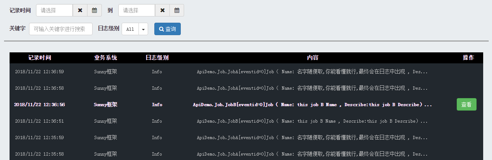

如果网络日志写入失败(通常是因为网络原因),会将日志写入到C:\SunnyFramework\OfflineLog下以日期作为文件名的txt文件里,如:

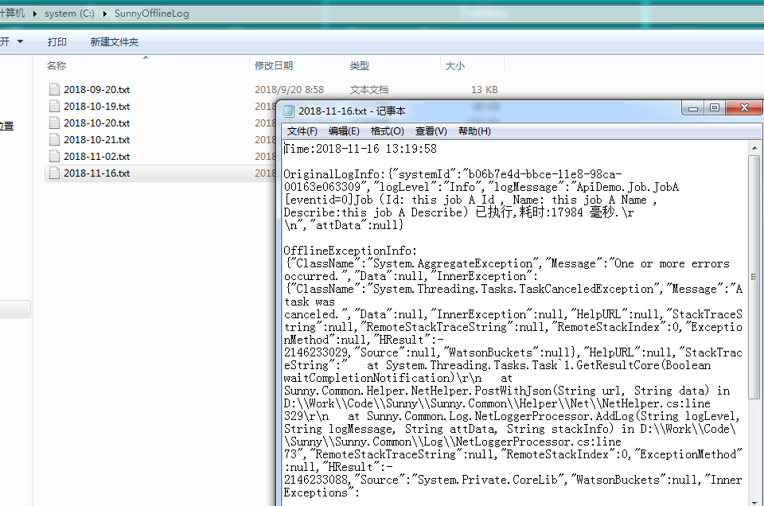

---

#### <a name="autoDi">自动依赖注入</a>

在StartUp.cs的ConfigureServices方法中加入以下代码:
```cs
DiHelper.AutoRegister(services);
```

当您的类或接口继承自ISingleton,IScoped,ITransient中的任意接口,系统启动时会自动注册依赖关系,在使用时可通过构造函数注入的方式获取您类或接口的实例.

首先我们的类或接口继承自以上任意接口:
```cs
  public interface IStudentServic:IScoped
    {

        Task<Student> GetStudent();

        Task<Student> GetStudent2();
    }


    public class SomeoneClass : IScoped
    {

        public string SomeoneMethod()
        {
            return "hello this is di class";
        }
    }
```

然后在我们要使用的地方通过构造函数注入:

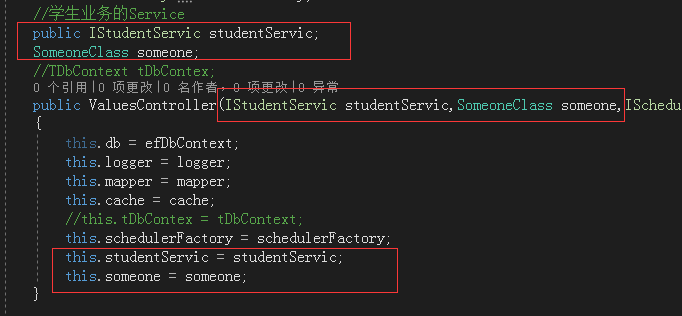

如果您不想使用构造函数的注入方式,也可以在要使用的地方直接创建实例:

```cs
 var s = DiHelper.CreateInstance<SomeoneClass>();
 var x = DiHelper.GetService<IStudentServic>();
```

---

#### <a name="redis">使用Redis缓存</a>

在appsetting.json中配置redis选项:
```json
"RedisOptions": {
      //连接字符串
      "ConnectionString": "127.0.0.1:6543",
      //调用方实例名称,redis中的key会自动以设置的字符串开头,用以标识是哪台机器存入的key
      "InstanceName": "api_",
      //默认的滑动过期时间多少秒,为了防止缓存击穿,实际存入时会在该时间上加10秒类的随机数
      "DefaultSlidingExpiration": 600
    }
```

在StartUp.cs的ConfigureServices方法中加入以下代码:
```cs
services.AddDistributedRedisCache(options =>
            {
                var configOption = Configuration.GetSection("SunnyOptions:RedisOptions").Get<RedisOption>();
                options.Configuration = configOption.ConnectionString;
                options.InstanceName = configOption.InstanceName;
                IDistributedCacheExtend.DefaultSlidingExpiration = configOption.DefaultSlidingExpiration;
            });
```

通过构造函数注入一个IDistributedCache的实例cache后即可调用:

```cs
        /// <summary>
        /// Redis测试
        /// </summary>
        /// <returns></returns>
        [HttpGet("GetRedis")]
        public async Task<IResult<dynamic>> GetRedis()
        {
            cache.SetString("aaa", "A杨家勇A");

            cache.Set("customer", new Customer());

            await cache.SetAsync("customerAsync", new Customer() { Address = "Async" });

            var cus = cache.Get<Customer>("customer");

            var cusAsync = await cache.GetAsync<Customer>("customerAsync");

            return this.SuccessDynamic(new { Cus = cus, CusAsync = cusAsync });
        }
```

---

#### <a name="jsonFormat">Long,Decimal,DateTime的Json处理</a>

当我们以js作为api的前端应用时,会发现Long,Decimal类型会产生精度丢失的现象,DateTime的日期中会带"T"的现象.

为此,我们将针对这三种类型的json格式化作加工处理,Long,Decimal转为字符串,前端传给我们的时候自动转为对应的类型.

DateTime类型我们显式的设置它的字符串格式.


在StartUp.cs的ConfigureServices方法中加入以下代码:
```cs
services.AddMvcCore()
                .AddJsonFormatters(x =>
                {
                    x.Converters.Add(new LongConverter());
                    x.Converters.Add(new DecimalConverter());
                    x.DateFormatString = "yyyy-MM-dd HH:mm:ss";
                    x.ContractResolver = new CamelCasePropertyNamesContractResolver();
                })
```

---

#### <a name="apiFormat">Api统一返回格式</a>

为了便于前端解析,只要成功调用到我们的Api时,每个返回的结果中都会由code,msg,data这三个元素组成.

code:为0时表示操作成功,为1时表示操作失败,为-1时表示操作异常.

msg:默认是"操作成功",当code不为0时,msg表示具体的失败原因,code为-1时显示"我们已经收到此次异常信息,将尽快解决!"

data:当code为0时表示返回的具体数据,code为非0时通常为null.


另外,为了我们在维护Api时一眼就能看出给前端返回的数据内容,建议将返回的数据项创建为一个类,在Api的返回结果中显示的指定该类IResult<T>,如:

```cs
        [HttpGet("GetOld")]
        public async Task<IResult<Student>> GetOld()
        {
            var y = await studentServic.GetStudent2();
             return this.Success(y);
             
         }
```

这样的好处是,在我们看Api时,不会一堆Api都返回object.


当操作失败时,我们要用 return this.Fail("这是原因");向前端返回失败的原因.


对于没有数据需要返回给前端,只要返回操作状态时,我们Api定义的返回值为IResult<T>的非泛型版本IResult

```cs
 /// <summary>
        /// 不带返回值的成功场景测试
        /// </summary>
        /// <returns></returns>
        // GET api/values
        [HttpGet("Get1")]
        public IResult Get1()
        {

            return this.Success();
        }
```

---

 #### <a name="dynamicProp">类型扩展动态属性与分页处理</a>

 通常我们会遇到这样的场景...我们要将某个枚举的中文意思返回给前端,但又不想新建一个类型,于是框架里有了一个偷懒的办法:

```cs
 [HttpGet("GetDynamic")]
public IResultata<dynamic> GetDynamic()
{
    A a= from db...;
    this.SuccessDynamic(a.Extend(new { EnumCn = a.LocalType.GetDescribe() }));
}

```
这样做的缺点就是不能通过Api的方法签名直观的看出返回的类型.

某些场景可能需要将列表中的每一项都扩展一些额外的属性返回,框架针对List<T>和PageData<T>扩展了一个方法ToDynamic,以解决这样的场景:

```cs
        /// <summary>
        /// 带返回值,且值为动态扩展对象的场景测试,分页测试
        /// </summary>
        /// <returns></returns>
        [HttpPost("pageTest")]
        public IResult<PageData<dynamic>> pageTest(PageInfo pageInfo)
        {
            var pageList = db.IdTest.Pagination(pageInfo);
            //让列表中返回的每一项都有At和Sort属性         
            return this.Success(pageList.ToDynamic(x => x.Extend(new { At = DateTime.Now, Sort = DateTime.Now.Millisecond })));
        }
```

分页测试:
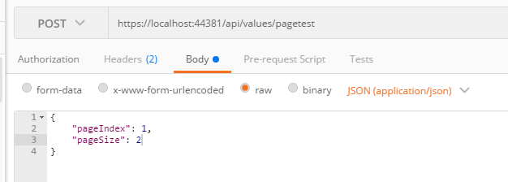
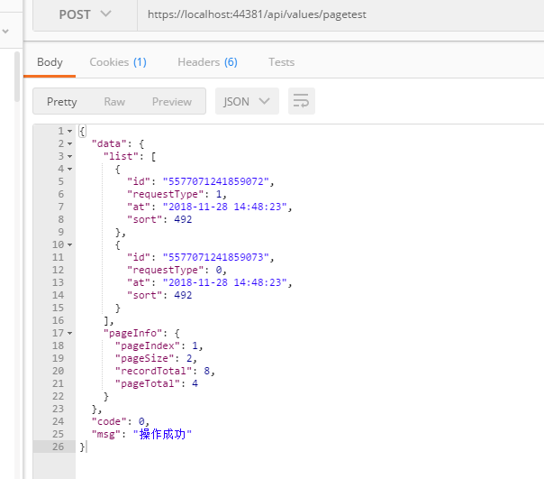


---

#### <a name="netHelper">网络铺助(发邮件,Ip信息查询)</a>

首先在appsettings.json中配置邮件发送和Ip查询选项:

```json
    //邮件配置
    "MailOption": {
      // 邮件服务器地址
      "EmailHost": "smtp.ym.163.com",
      // 用户名
      "EmailUserName": "you user name",
      // 密码
      "EmailPassword": "you password",
      // IP白名单列表,在列表中的IP发邮件前不执行检查事件
      "IPWhiteList": [ "127.0.0.1" ]
    },
     //查询IP信息的配置
    "IpInfoQueryOption": {
      //IP查询的API
      "ApiUrl": "http://www.ip.cn/index.php?ip="
    },
```

然后在StartUp.cs的ConfigureServices方法中加入以下代码:
```cs
services.Configure<MailOption>(Configuration.GetSection("SunnyOptions:MailOption"));
services.Configure<IpInfoQueryOption>(Configuration.GetSection("SunnyOptions:IpInfoQueryOption"));
```

在使用到的地方通过构造函数注入配置项:

```cs
        MailOption mailOption;
        IpInfoQueryOption ipQueryOption;
        
        public ValuesController(IOptions<MailOption> mailOption,IOptions<IpInfoQueryOption> ipQueryOption)
        {

            this.mailOption = mailOption.Value;
            this.ipQueryOption = ipQueryOption.Value;
        }


```

再调用NetHelper的相关方法即可,如:
```cs
        [HttpGet("IpQuery")]
        public IResult<IPInfo> IpQuery()
        {
            //var ip=NetHelper.GetClientIP(this.HttpContext);
            var ip = "171.214.202.111";
            return this.Success(NetHelper.QueryIpInfo(ip, ipQueryOption));
        }

        [HttpGet("MailTest")]
        public  IResult<string> MailTest()
        {
            MailInfo mailInfo = new MailInfo();
            mailInfo.Content = "hello";
            mailInfo.OperaterID = "yh";
            mailInfo.OperaterIP = NetHelper.GetClientIP(this.HttpContext);
            mailInfo.Title = "this is test mail";
            mailInfo.ToMail = "someone@qq.com";


            NetHelper.AsyncSendEmail(mailInfo, mailOption);
            return this.Success("ok");
        }
```

---

#### <a name="stringEnumEx">字符串与枚举相关的扩展</a>

字符串扩展部分的内容就不一一列举了,请通过"".来查看相关的方法,枚举主要扩展了一个GetDescribe()方法来获取DescriptionAttribute属性标注的内容,如果没有标注则返回枚举项的或称.

另外字符串的辅助类请用StringHelper.点出来看.

---

#### <a name="imageHelper">图片缩放,水印,验证码图片等</a>

图片的处理,如缩放,加水印,生成验证码图片等方法都在ImageHelper中,直接调用相关方法即可使用.

---

#### <a name="fileHelper">Xml文件,文本文件读取写入</a>

Xml文件的操作请见XMLHelper类中的方法.

文本文件的操作请见FileHelper类中的方法.

---

#### <a name="security">加解密相关</a>

加解密相关的操作请见SecurityHelper中提供的方法,目前提供了MD5,SHA1加密以及Des的加解密.

---

#### <a name="base64">Base64序列化相关</a>

Base64的序列化操作请见SerializeHelper中提供的方法.

---

#### <a name="xx">go on</a>

使用文档不断完善中,如果在使用中遇到问题,可以查看UseDemo或到技术交流QQ群852498368寻求帮助.

如果该框架有帮助到您,请送上您的小星星哦.

如果您愿意贡献代码,请尽情的Fork吧,希望更多的人因为我们的存在而让生活变得更加美好!

